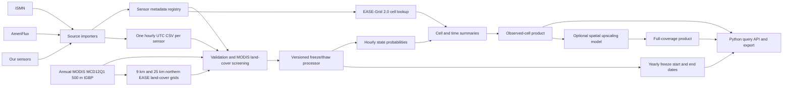

# Proposed project workflow

This is how I see `sfcc-label` developing: a reproducible path from individual sensor measurements to a user request for soil freeze/thaw information on the **Northern Hemisphere EASE-Grid 2.0**. The repository currently implements the data contract, validation, grid lookup, and a preliminary summary of sampled sensors. The classification method, source-specific importers, and full-coverage gridded product are future work.



## 1. Collect and preserve source data

Keep the original ISMN, AmeriFlux, and local files in a local source archive, along with source names, versions, citations, and any use restrictions. The first importer now reads the supplied ISMN header+values export from its existing location. It indexes northern sites, pairs temperature and moisture streams by exact depth and instrument identity where possible, and writes bounded hourly UTC CSVs. It preserves original flags in compressed sidecars without making a new QA/QC decision. The importer for AmeriFlux and local data still needs representative files.

Each depth-specific observation stream gets a stable `sensor_id`; temperature and moisture can come from separate physical probes. Multiple depths at one site stay separate because their measurements and freeze/thaw behavior may differ. Metadata lives in `metadata/sensors.csv` and includes WGS84 latitude/longitude, depth, source identifiers, the meaning and unit of the raw channel, and optional fields for land cover or modeled soil properties. Enrichment values should keep their dataset name/version and method so they can be refreshed later.

For ISMN, the populated site/sensor tables are under Git-ignored `metadata/private/`, while `metadata/sensors.csv` remains the public schema template. The site table has one latitude/longitude per site; the sensor table repeats those coordinates with depth bounds and a stable site ID. The pairing report records exactly which `ts` and `sm` source files produced each sensor record. Replacements and redundant probes remain separate. Soil-moisture-only streams are indexed but not turned into classifier inputs. The source export is about 22 GB and the workspace has limited free space, so time-series imports are intentionally bounded by requested dates and sensor filters.

## 2. Standardize to hourly observations

Create `data/standardized/<sensor_id>.csv` with exactly one record per UTC hour and these columns:

| Column | Meaning |
| --- | --- |
| `timestamp_utc` | Hour start, such as `2024-01-01T00:00:00Z` |
| `soil_temperature_c` | Soil temperature in degrees Celsius |
| `soil_moisture_m3_m3` | Volumetric water content as a fraction, when available |
| `raw_value` | Original sensor output, such as frequency count or permittivity |

Unavailable measurements are `NaN`. If an hour is absent from the source, include an all-`NaN` hourly row and retain the original source record separately. We should document each importer's time-zone conversion and hourly resampling rule. The current validator checks UTC timestamps, consecutive hourly rows, and numeric ranges; it does not yet import or resample source data.

The single `raw_value` column covers one native channel per sensor, with its name and unit in metadata. The inspected ISMN export includes harmonized soil moisture and temperature but no raw frequency/count signal, so its `raw_value` is `NaN`. If another source supplies multiple useful raw channels, we should extend the schema explicitly, for example with a separate long-format raw-observations table.

## 3. Validate and enrich

Before modeling, verify unique sensor IDs, coordinates, units, depth, hourly continuity, duplicate timestamps, and missingness. Keep source quality flags for later filtering. The ISMN importer currently preserves flagged finite values and does not perform new anomaly QA/QC; that later stage needs explicit acceptance and masking rules. Add optional modeled soil variables to metadata with provenance. Generate a per-sensor coverage report so we know whether temperature, moisture, or raw measurements are sufficient for classification.

For land-cover representativeness, use each year's MODIS MCD12Q1 Collection 6.1 `LC_Type1` IGBP map. Sample the native 500 m pixel at every sensor location and save the class by sensor and year in `metadata/sensor_landcover.csv`. From that same annual source, create a dominant-class raster on each supported northern EASE grid (9 km and 25 km). For each sensor, year, and resolution, compare its 500 m class to its cell's dominant class. An exact match is eligible; a mismatch or missing class is excluded from later **aggregation**, with the reason recorded in `metadata/landcover_screen.csv`. Do not delete the original station observations or predictions. This is a requested screening rule; class agreement alone does not prove that a sensor represents every condition in the cell.

Because MODIS land cover is annual, eligibility is year-specific. The raster step needs one correctly georeferenced IGBP mosaic per year. If no MODIS map exists for an observation year, that sensor-year is not eligible until a documented fallback-year policy is supplied. The current code uses categorical mode resampling to create the coarser EASE grid class and supports both northern resolutions. It does not download NASA granules or use MODIS QA flags yet. The [cited SMOS paper](https://essd.copernicus.org/articles/17/5337/2025/) used ESA CCI 300 m land cover and additional coverage checks, so its exact method is distinct from this MODIS class-match rule.

The available command is:

```bash
sfcc-label validate metadata/sensors.csv data/standardized
sfcc-label prepare-landcover 2020 data/raw/MCD12Q1_2020_LC_Type1.vrt
```

## 4. Classify each sensor hour

A versioned processor will consume a sensor's metadata and hourly series and return three probabilities:

```text
P(frozen), P(transition), P(thawed)
```

For a classified hour the probabilities sum to 1; the largest gives the label. For an hour the model cannot classify, all three probabilities should be missing rather than set to zero. Output goes to `data/processed/<sensor_id>.csv`, with `model_version` on each row. The processor interface is present in the package, but its scientific logic intentionally awaits your rules.

We will need to define which inputs are required, how missing moisture is handled, what “transition” means physically, how probabilities are calibrated, and how the model is validated across sites and years. Different sensor types may need different feature extraction before the common classifier.

## 5. Derive annual freeze events

From hourly probabilities or labels, derive `freeze_start_utc` and `freeze_end_utc` for each sensor and year. These dates should be a separate table because they summarize a season rather than an hour. We still need your definitions for the year boundary, minimum persistence, short thaw interruptions, multiple freeze cycles, and incomplete records. The model version and event-rule version should be recorded so results remain reproducible.

For each cell and year, **retain all sensor-level event dates**. After land-cover screening, the agreed cell summary reports the **median, earliest, and latest** freeze-start dates, and separately the median, earliest, and latest freeze-end dates. Each has its own contributing sensor count because one event may be missing while the other is known. Missing dates are excluded from that event's statistics. These are summaries of sampled sensors, not dates on which the entire cell froze or thawed. The `aggregate_yearly_events` helper implements this summary for supplied per-sensor events; it does not determine the events themselves. Only combine sensors at comparable depths, and keep the method version in the output.

## 6. Place sensors on the northern EASE-Grid 2.0 and summarize each cell

Map each sensor's WGS84 coordinates to the **Northern Hemisphere** EASE-Grid 2.0 projection (EPSG:6931). The 9 km grid has 2,000 rows and 2,000 columns, with 9,000 m cells. The package also supports the northern 25 km grid. A cell may contain zero, one, or several sensors. We should decide whether observations at different depths can enter the same cell-hour summary; the default scientific product should identify or filter depth before combining them.

Temperature and moisture can be summarized with a mean over **land-cover-eligible** valid sensors, with separate counts for each variable, provided their depth and measurement meaning are comparable. The mean should be accompanied by a spread (for example standard deviation or quantiles) and source coverage. Missing moisture must not reduce the temperature count.

**A categorical state is different.** If 7 of 10 sensors are labeled frozen and 3 transition, the observed label shares are 0.70 frozen, 0.30 transition, and 0 thawed. The cell is mixed in the sampled locations; assigning it a single frozen label would hide that heterogeneity. Retain the counts as well as the shares.

Each sensor also has a probability vector. Take the mean of those vectors to describe the expected state share **among the sampled sensor locations**. For example, if the 7 frozen-labeled sensors each have `(0.9, 0.1, 0.0)` and the 3 transition-labeled sensors each have `(0.2, 0.8, 0.0)`, the mean vector is `(0.69, 0.31, 0.0)`. This differs from the hard-label shares `(0.70, 0.30, 0.0)`. Keep both; neither means “69% probability that the entire cell is frozen.” The code now calls the soft values `mean_sensor_p_*` and does not produce a cell label.

These summaries only represent the cell area if the sensors adequately sample it. Ten sensors clustered at one site are not ten independent samples of a 9 km cell. Later, an explicit spatial model could use sensor positions, land cover, terrain, modeled soil variables, and calibration data to estimate **area fractions** or a **cell-level state probability**. That would be a separate, validated product with uncertainty and a method version. We should not fill an empty cell by averaging nearby sensor labels without such a model.

## 7. Let users request processed data

The intended package entry point can request any time span and all northern grid cells, for example hourly data for 2020–2022, or a smaller set of cells:

```python
from sfcc_label import get_processed_data

rows = get_processed_data(
    gridded_predictions,
    start_utc=start,
    end_utc=end,
    cell_ids={"EASE2_N_9km_r1151_c0484"},
)
```

Today this filters records already loaded in memory. The future public interface should load a versioned dataset by grid and time range and offer two clear modes: **observed cells only**, with missing cells reported as no data; and, if validated later, a **full-coverage modeled product**. A 2,000 × 2,000 grid over three hourly years has more than 100 billion cell-hours, so an all-cells request must be served with chunked, lazy reads or streamed export, not a single in-memory list. Output should include temperature/moisture statistics, state counts and shares, mean sensor probability vectors, sample counts, depth, missingness, and provenance. A compact format such as Zarr, NetCDF, or partitioned Parquet should be selected after we estimate actual coverage and access patterns.

## What exists now and what comes next

| Part | Current state | Next input needed |
| --- | --- | --- |
| Metadata and hourly CSV contract | Defined and validated | Example source files and field mapping |
| ISMN harmonization | Northern site/sensor index and bounded hourly importer working locally | Decide full-output storage location and review ambiguous depth pairing |
| MODIS land-cover screening | Annual metadata, grid builder, and exact-match gate implemented | Annual MCD12Q1 IGBP mosaics and sensor coordinates |
| ISMN / AmeriFlux / local importers | Planned | Representative files and access rules |
| Freeze/thaw probabilities | Processor interface only | Scientific labeling method and training/validation plan |
| Annual freeze dates | Cell median, range, and counts implemented for supplied sensor events | Sensor-level event definitions |
| EASE-Grid lookup | Working for northern 9 km and 25 km | Preferred product resolution |
| Grid state summaries | Working counts, label shares, and mean sensor probabilities | Depth policy, sensor weighting, minimum coverage |
| Full-coverage grid | Planned | Spatial model and independent validation |
| User query | In-memory filtering of observed cells | Chunked dataset storage and delivery choice |

The first practical milestone is to standardize a small set of representative sensors from each source and inspect coverage and raw channels. That will reveal whether the current four-column hourly format needs an extension before we implement the classifier.
