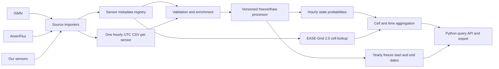

# Proposed project workflow

This is how I see `sfcc-label` developing: a reproducible path from individual sensor measurements to a user request for soil freeze/thaw probabilities on EASE-Grid 2.0. The repository currently implements the data contract, validation, grid lookup, and a preliminary aggregation function. The classification method and source-specific importers are future work.



## 1. Collect and preserve source data

Keep the original ISMN, AmeriFlux, and local files in `data/raw/`, along with source names, versions, citations, and any use restrictions. We should build one importer per source format after we have representative files. The importer should preserve quality flags and record any calibration or conversion used to obtain soil moisture.

Each physical sensor gets a stable `sensor_id`. Multiple depths at one site are separate sensors because their temperature, moisture, and freeze/thaw behavior may differ. Metadata lives in `metadata/sensors.csv` and includes WGS84 latitude/longitude, depth, source identifiers, the meaning and unit of the raw channel, and optional fields for land cover or modeled soil properties. Enrichment values should keep their dataset name/version and method so they can be refreshed later.

## 2. Standardize to hourly observations

Create `data/standardized/<sensor_id>.csv` with exactly one record per UTC hour and these columns:

| Column | Meaning |
| --- | --- |
| `timestamp_utc` | Hour start, such as `2024-01-01T00:00:00Z` |
| `soil_temperature_c` | Soil temperature in degrees Celsius |
| `soil_moisture_m3_m3` | Volumetric water content as a fraction, when available |
| `raw_value` | Original sensor output, such as frequency count or permittivity |

Unavailable measurements are `NaN`. If an hour is absent from the source, include an all-`NaN` hourly row and retain the original source record separately. We should document each importer's time-zone conversion and hourly resampling rule. The current validator checks UTC timestamps, consecutive hourly rows, and numeric ranges; it does not yet import or resample source data.

The single `raw_value` column covers one native channel per sensor, with its name and unit in metadata. If a sensor supplies multiple useful raw channels, we should extend the schema explicitly, for example with a separate long-format raw-observations table. We should settle this after seeing actual files.

## 3. Validate and enrich

Before modeling, verify unique sensor IDs, coordinates, units, depth, hourly continuity, duplicate timestamps, and missingness. Keep source quality flags for filtering. Add optional land cover and modeled soil variables to metadata with provenance. Generate a per-sensor coverage report so we know whether temperature, moisture, or raw measurements are sufficient for classification.

The available command is:

```bash
sfcc-label validate metadata/sensors.csv data/standardized
```

## 4. Classify each sensor hour

A versioned processor will consume a sensor's metadata and hourly series and return three probabilities:

```text
P(frozen), P(transition), P(thawed)
```

For a classified hour the probabilities sum to 1; the largest gives the label. For an hour the model cannot classify, all three probabilities should be missing rather than set to zero. Output goes to `data/processed/<sensor_id>.csv`, with `model_version` on each row. The processor interface is present in the package, but its scientific logic intentionally awaits your rules.

We will need to define which inputs are required, how missing moisture is handled, what “transition” means physically, how probabilities are calibrated, and how the model is validated across sites and years. Different sensor types may need different feature extraction before the common classifier.

## 5. Derive annual freeze events

From hourly probabilities or labels, derive `freeze_start_utc` and `freeze_end_utc` for each sensor and year. These dates should be a separate table because they summarize a season rather than an hour. We still need your definitions for the year boundary, minimum persistence, short thaw interruptions, multiple freeze cycles, and incomplete records. The model version and event-rule version should be recorded so results remain reproducible.

## 6. Place sensors on EASE-Grid 2.0 and aggregate

Map each sensor's WGS84 coordinates to a standard global EASE-Grid 2.0 cell (EPSG:6933). The package currently supports the 9 km and 25 km global grids, using NSIDC's published dimensions and origins. A grid cell may contain zero, one, or several sensors.

For each hour and cell, the current provisional method averages the available sensor probabilities and reports `station_count`. This is useful for a first queryable product, but it is not a spatial estimate for cells without sensors and does not establish calibrated grid-level uncertainty. Before a research release, we should decide whether to use depth filters, sensor weighting, minimum station coverage, and modeled covariates. Yearly event dates should be aggregated only after their scientific meaning and spatial summary rule are agreed.

## 7. Let users request processed data

The intended package entry point is a query such as:

```python
from sfcc_label import get_processed_data

rows = get_processed_data(
    gridded_predictions,
    start_utc=start,
    end_utc=end,
    cell_ids={"EASE2_G_9km_r0231_c1139"},
)
```

Today this filters records already loaded in memory. The later public interface should load a versioned dataset by grid, time range, and possibly bounding box; return probabilities, labels, station counts, and provenance; and support a clear export format such as Parquet or NetCDF. We should choose the storage and distribution method after estimating the number of sensors and years.

## What exists now and what comes next

| Part | Current state | Next input needed |
| --- | --- | --- |
| Metadata and hourly CSV contract | Defined and validated | Example source files and field mapping |
| ISMN / AmeriFlux / local importers | Planned | Representative files and access rules |
| Freeze/thaw probabilities | Processor interface only | Scientific labeling method and training/validation plan |
| Annual freeze dates | Output record defined | Event definitions |
| EASE-Grid lookup | Working for global 9 km and 25 km | Preferred product resolution |
| Grid aggregation | Working provisional mean | Scientific aggregation policy |
| User query | In-memory filtering | Dataset storage and delivery choice |

The first practical milestone is to standardize a small set of representative sensors from each source and inspect coverage and raw channels. That will reveal whether the current four-column hourly format needs an extension before we implement the classifier.
